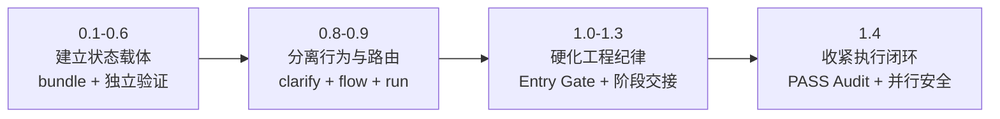
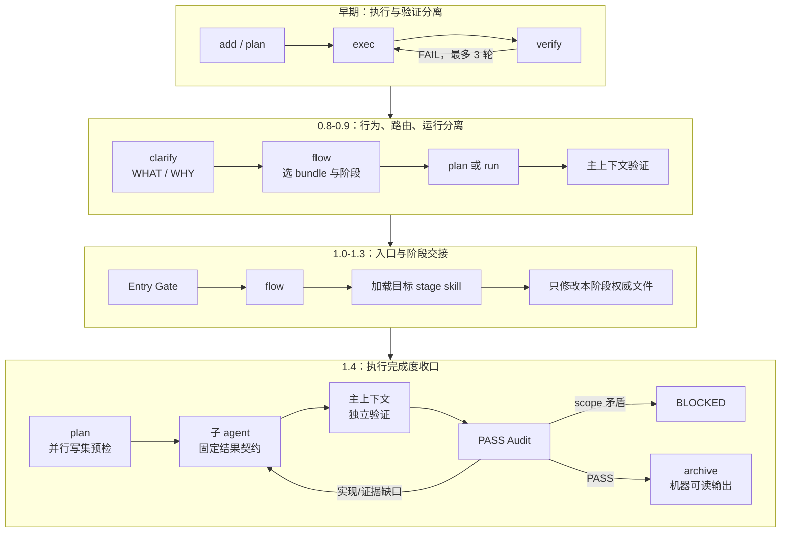
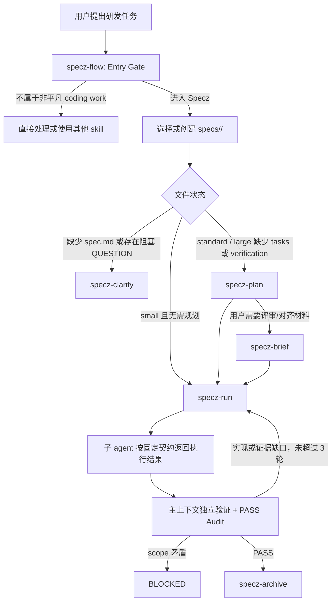

# Specz 技术分享：从 spec bundle 到可验证的 Agent 工程闭环

## 面向读者

本文面向日常使用 Codex、Claude Code、Pi Coding Agent 或类似 AI coding agent 的研发同事。它不是一篇插件安装说明，而是一篇技术分享：Specz 为什么会演进成现在的样子，它解决了 coding agent 在复杂研发任务中的哪些问题，以及它和常见 flow skill 的关键区别。

本文基于两类信息整理：

- 当前 `specz` 插件文档、manifest 和六个 skill 的职责。
- `specz/` 目录的 git 提交历史，包括从 `7002fcf` 初始提交到当前 `1.4.1` 的主要演进节点。

## 一句话概括

Specz 是一个轻量的规范驱动工程 workflow 插件。它面向非平凡 coding development work：功能实现、bug 修复、CI 修复、重构、API / schema / migration / infra 变更，以及继续已有开发任务。

**它最核心的价值不是“让 agent 写更多计划”，而是把 agent 开发过程变成一个可恢复、可审查、可验证、可归档的工程闭环。**

## 最初的问题意识

AI coding agent 做小改动很快，但做复杂任务时容易出现几类典型问题：

| 问题 | 典型表现 | 结果 |
|---|---|---|
| 需求语义漂移 | agent 一边执行一边重新解释用户意图 | 做出来的代码和验收目标不一致 |
| 执行者自证 | 写代码的 agent 自己说“完成了”，验证只跑顺手的命令 | 失败信号被忽略 |
| 长任务不可恢复 | 会话中断、上下文压缩或换 agent 后，只剩聊天记录 | 继续任务时重复探索或漏掉决策 |
| 文档和执行脱节 | spec、task、test 互相没有可追溯关系 | 任务做完了，但不知道覆盖了哪个需求 |
| 完成状态失真 | 子 agent 返回 `DONE`，主上下文就直接宣布通过 | 任务声称完成，但场景证据、临时件或未完成项仍有缺口 |
| 并行写入冲突 | 多个 agent 同时修改同一文件或共享状态 | 合并覆盖、接口错位，返工成本高于并行收益 |
| flow prompt 膨胀 | 一个 skill 同时负责澄清、规划、执行、验证、总结 | 简单任务也背负重流程，复杂任务又容易职责混乱 |

Specz 的发展过程基本就是围绕这些问题持续收敛。

## 演进主线

如果按每个版本逐段讲，Specz 的演进会显得比实际复杂。更准确的理解方式，是把它归纳成四次关键变化：**先建立可持久化状态，再分离行为与实现，然后收紧阶段责任，最后补齐完成度与并行安全。**

### 1. 建立状态载体：从聊天过程到可恢复 bundle（0.1-0.6）

初始版本用 `spec.md` 固定范围和验收，将执行与验证拆给 `exec`、`verify`，再由 `auto-run` 控制最多 3 轮修复。随后加入可选 `design.md`，避免 executor 在实现时即兴决定架构；又用统一的 `verification.md` 取代容易重复的 `checklist.md` 和 `test-cases.md`。

目录也从本地 `.specs/<slug>.v<index>/` 迁移到可进入版本控制的 `specs/<summary-slug>/`。

**关键变化：Specz 从“本地临时规划状态”变成“可协作、可恢复、可追溯的工程状态”。**

### 2. 分离行为与路由：从多段控制器到轻量入口（0.8-0.9）

`0.8.0` 引入 `specz-clarify`，规定 `spec.md` 只写 WHAT / WHY，并按 `small`、`standard`、`large` 分流；`0.9.0` 再用 `specz-flow` 统一选择 bundle 和下一阶段，把原来的 `exec`、`verify`、`auto-run` 收敛为 `specz-run`，同时删除额外的 `specz-status` 状态镜像。

**关键决策：`spec.md` 负责稳定描述行为，`flow` 只负责路由，`run` 负责有界执行与验证；状态由 bundle 文件即时恢复，不再维护第二套状态。**

当前 Size Routing 按目标耦合度、任务拆分需求、设计决策和风险分级，而不是按文件数分级。同一个低风险、同模式改动即使分布在多个组件文件中，也可以从 `spec.md` 直接进入 `specz-run`。

### 3. 硬化工程纪律：阶段不再互相越权（1.0-1.3）

这一时期没有重做主流程，而是在入口和交接处加约束：Entry Gate 排除 docs-only、skill/prompt、研究和咨询任务；可选 `brief.md` 服务产品、研发、测试共读，但不参与执行；flow 路由后必须加载对应阶段 skill。`1.3.0` 又通过测试 prompts 和独立评估收紧路由与澄清边界。

**关键决策：每个阶段只修改自己拥有的状态文件，人读简报不能升级为执行权威。**

### 4. 收紧执行闭环：区分“声称完成”和“证明完成”（1.4）

`1.4.0` 没有增加新阶段，而是补齐三个容易产生假完成的缺口：

- 子 agent 按固定契约返回状态、改动、命令、证据、疑虑、临时件和下一步。
- `[P]` 任务在 plan 中声明 `Write set`、共享状态、冲突风险和串行回退方案，run 在派发前再次检查重叠。
- 主上下文写 PASS 前执行 PASS Audit，核对场景证据、任务状态、证据新鲜度和临时件清理。

`1.4.1` 进一步移除单一厂商模型硬编码，并为 archive 增加机器可读 Output。当前仓库也已提供 Pi Coding Agent extension，与 Codex、Claude Code 共享相同的 bundle 和阶段权威。

**关键变化：子 agent 的 `DONE` 只代表执行声明；只有主上下文完成独立验证和 PASS Audit，Specz 才能给出 PASS。**

### 流程形态如何变化

下面这张图只保留每一时期新增或改变的责任，能更直观看出 Specz 如何从“执行/验证循环”演进为“有入口、有状态权威、有最终审计”的闭环：

## 当前 Specz 的架构

当前版本包含六个 skill：

| Skill | 当前职责 |
|---|---|
| `specz-flow` | 主入口。判断是否进入 Specz，选择 active bundle，并路由到下一阶段。 |
| `specz-clarify` | 创建或更新行为规格 `spec.md`，完成规模分流。 |
| `specz-plan` | 为 standard / large 任务生成最小充分规划，并检查计划一致性与 `[P]` 任务的并行写入安全。 |
| `specz-brief` | 可选的人读简报，服务产品、研发、测试对齐。 |
| `specz-run` | 按子 agent 输出契约执行任务，由主上下文独立验证、执行 PASS Audit，并最多进行 3 轮 repair loop。 |
| `specz-archive` | 验证通过后写归档记录与学习候选，移除原 bundle，并返回机器可读结果。 |

当前推荐流程是：

## 当前 bundle 文件为什么是这几个

Specz 的文件数量是长期演进后的结果。

| 文件 | 角色 | 为什么保留 |
|---|---|---|
| `spec.md` | 行为权威 | 固定 WHAT / WHY、范围、业务规则、场景和验收，防止需求漂移。 |
| `design.md` | 实现设计 | 只在需要时出现，避免 executor 即兴选择架构。 |
| `tasks.md` | 执行状态 | 记录可执行任务、依赖和 repair task；并行任务还记录写集、共享状态、冲突风险和串行回退方案。 |
| `verification.md` | 证据状态 | 记录验证矩阵和最新验证结果，防止验证被执行叙事污染。 |
| `brief.md` | 人读对齐 | 可选，帮助产品、研发、测试理解计划，但不作为执行权威。 |
| archive record | 历史事实 | 通过验证后保留结果、取舍、证据和有来源的学习候选；原 bundle 删除，避免活跃状态堆积。 |

早期的 `checklist.md` 和 `test-cases.md` 被移除，并不是因为验收和测试不重要，而是因为它们的职责被更集中的 `verification.md` 吸收了。Specz 一直在做减法：保留对工程闭环有独立价值的状态面，删除容易重复或制造维护负担的文件。

## Specz 和常见 flow skill 的区别

| 常见方案 | 优点 | 常见短板 | Specz 的优势 |
|---|---|---|---|
| Plan / Act flow | 简单，容易理解 | 计划停留在对话里，恢复和追踪弱 | bundle 文件是状态源，跨会话可恢复 |
| Todo checklist skill | 执行清晰 | 待办项容易反向定义需求 | `spec.md` 是行为权威，`tasks.md` 只是执行面 |
| Auto-run executor | 自动推进 | 容易相信 executor 自述或无限修复 | `DONE` 不等于 PASS；主上下文验证、PASS Audit 和最多 3 轮上限共同收口 |
| Spec / PRD writer | 文档质量较高 | 文档和实现验证脱节 | Specz 覆盖 clarify、plan、run、archive 全闭环 |
| OpenSpec 类规范流程 | 规范严谨，适合契约化需求 | 对日常 coding agent 任务可能偏重 | Specz 保留规范化表达，但用 size routing 和可选 design 控制成本 |
| 多 agent dispatcher | 能分派任务 | 上下文和验收责任容易丢，并行写入容易冲突 | 子 agent 有固定返回契约；主 agent 持有 spec、并行安全检查和最终验收责任 |

区别可以压缩成一句话：

> 常见 flow skill 更关注“下一步做什么”；Specz 更关注“当前事实在哪里、谁拥有阶段责任、什么证据证明完成”。

## Specz 的关键优势

### 1. 可恢复

状态不藏在对话里，而在 `specs/<bundle>/` 文件里。上下文压缩、会话中断、换 agent 或隔天继续，都可以从 bundle 文件恢复。

### 2. 可追溯

`tasks.md` 和 `verification.md` 都要关联 `SPEC-*` 场景。每个任务覆盖哪个需求、每条验证证明哪个场景，都能回到 `spec.md`。

### 3. 可验证

Specz 不接受 executor 自述作为最终证明。验证必须来自测试、typecheck、lint、浏览器/runtime、API/CLI、日志或产物检查等具体证据。1.4 进一步要求 PASS Audit 同时确认场景证据、任务状态、证据新鲜度和临时件清理一致。

### 4. 有边界

`specz-flow` 有 Entry Gate。docs-only、skill/prompt、纯设计、研究、咨询默认不进入 Specz。流程只在风险值得它介入时启用。

### 5. 有收敛

最多 3 轮 execute -> verify 修复循环。失败会写成聚焦的 repair task，而不是让 agent 无限尝试。

### 6. 有历史沉淀但不迷信历史

archive 记录能帮助后续理解过去的取舍和证据，并可保留有来源的验证陷阱和代码质量经验，但它不是当前事实。当前请求、active bundle、当前代码和验证结果始终优先。

### 7. 并行可控

并行不是一个随意添加的 `[P]` 标签。计划阶段先声明 Write set 和共享状态，执行阶段再检查一次重叠；一旦触及共享面或发现冲突风险，就按 Fallback 串行化。

## 适用边界

默认适合进入 Specz：

- 功能实现或运行时行为变更
- bug、回归、CI failure、测试修复
- 多文件或多模块重构
- API、schema、权限、迁移、持久化、infra 相关改动
- 继续、验证或归档已有 Specz bundle

默认不适合进入 Specz：

- README、安装说明、changelog 等 docs-only 编辑
- `SKILL.md`、agent prompt、hook reminder、marketplace、plugin metadata 等文本维护
- 纯设计探索、产品审查、研究、咨询、总结
- 单轮就能安全完成的简单问答或小命令

这个边界很关键。Specz 不是“所有任务都必须走的流程”，而是在复杂度、风险和恢复成本达到一定程度时才启用的工程约束。

## 一个简化示例

假设用户提出：

> 修复订单列表筛选状态刷新后丢失的问题，并补上回归验证。

Specz 的处理方式大致是：

1. `specz-flow` 判断这是非平凡 coding work，创建或选择 `specs/订单筛选状态恢复/`。
2. `specz-clarify` 写 `spec.md`，明确刷新后筛选条件应如何保留、哪些筛选项在范围内、验收场景是什么。
3. `specz-plan` 检查订单列表入口、路由参数、状态管理和已有测试，必要时写 `design.md`，然后生成 `tasks.md` 和 `verification.md`；如果标记并行任务，还要声明并检查各自 Write set。
4. `specz-run` 派发执行，子 agent 按固定契约返回改动、命令、证据和疑虑，主上下文按 `verification.md` 做独立验证。
5. 如果刷新后仍丢状态，写入 `[verify-repair]` 任务并继续下一轮。
6. 验证通过后执行 PASS Audit，确认关键场景证据、任务状态、证据新鲜度和临时件清理都一致，才写入 PASS。
7. `specz-archive` 归档最终结果、关键取舍、验证证据和有来源的学习候选，并返回机器可读归档结果。

任何人接手都能从 bundle 文件知道：

- 真实目标是什么
- 哪些边界已经确认
- 为什么这样设计
- 哪些任务覆盖哪些场景
- 哪些验证证据证明通过

## 对研发团队的启发

Specz 的长期演进有一个很清晰的方向：不是不断增加流程，而是不断明确状态权威和阶段责任。

早期它有四个 bundle 文件、三个执行相关 skill 和版本化 `.specs` 目录；后来引入 design、verification、clarify、flow、run、brief、archive；再后来又删除 status、合并 exec/verify/auto-run、移动图示模板、强化阶段 Gate、增加 reminder 和测试 prompt。到 1.4，演进重点变成完成度审计、子 agent 交接和并行写入安全。

这些变化背后的共同目标是：

- 复杂任务需要规格，但规格不能变成实现细节。
- agent 可以执行代码，但不能自证最终正确。
- 子 agent 的完成声明必须结构化返回，并由主上下文重新验证。
- 规划需要真实代码上下文，但不能过度设计。
- 并行必须建立在可检查的写集和共享状态上，而不是任务标题看起来互不相关。
- 文件要能恢复状态，但不能多到维护困难。
- flow 要能推进任务，但不能越权执行阶段工作。
- 跨平台插件不能把执行能力绑定到某一家厂商的模型名称。

## 结论

Specz 不是一个“更复杂的计划模板”。它是从多轮实践里收敛出来的 agent 工程流程：用 `spec.md` 固定行为目标，用 `design.md` 控制必要设计，用 `tasks.md` 管理执行与并行安全，用 `verification.md` 管理证据，用子 agent 契约和 PASS Audit 区分“声称完成”与“证明完成”，再用 archive 留下历史事实和可审查的学习候选。

和常见 flow skill 相比，Specz 的优势不在于步骤更多，而在于每个步骤都有清晰的状态文件、责任边界和验证要求。对研发团队来说，这能把 coding agent 从“一次性聊天助手”推进到“可协作的工程执行单元”。
