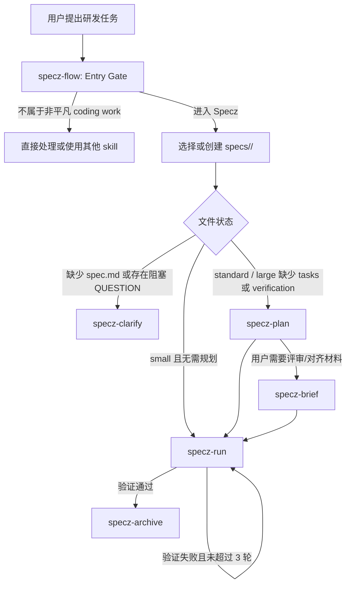

# Specz 技术分享：从 spec bundle 到可验证的 Agent 工程闭环

## 面向读者

本文面向日常使用 Codex、Claude Code 或类似 AI coding agent 的研发同事。它不是一篇插件安装说明，而是一篇技术分享：Specz 为什么会演进成现在的样子，它解决了 coding agent 在复杂研发任务中的哪些问题，以及它和常见 flow skill 的关键区别。

本文基于两类信息整理：

- 当前 `specz` 插件文档、manifest 和六个 skill 的职责。
- `specz/` 目录的 git 提交历史，包括从 `7002fcf` 初始提交到当前 `1.3.0` 的主要演进节点。

## 一句话概括

Specz 是一个轻量的规范驱动工程 workflow 插件。它面向非平凡 coding development work：功能实现、bug 修复、CI 修复、重构、API / schema / migration / infra 变更，以及继续已有开发任务。

它最核心的价值不是“让 agent 写更多计划”，而是把 agent 开发过程变成一个可恢复、可审查、可验证、可归档的工程闭环。

## 最初的问题意识

AI coding agent 做小改动很快，但做复杂任务时容易出现几类典型问题：

| 问题 | 典型表现 | 结果 |
|---|---|---|
| 需求语义漂移 | agent 一边执行一边重新解释用户意图 | 做出来的代码和验收目标不一致 |
| 执行者自证 | 写代码的 agent 自己说“完成了”，验证只跑顺手的命令 | 失败信号被忽略 |
| 长任务不可恢复 | 会话中断、上下文压缩或换 agent 后，只剩聊天记录 | 继续任务时重复探索或漏掉决策 |
| 文档和执行脱节 | spec、task、test 互相没有可追溯关系 | 任务做完了，但不知道覆盖了哪个需求 |
| flow prompt 膨胀 | 一个 skill 同时负责澄清、规划、执行、验证、总结 | 简单任务也背负重流程，复杂任务又容易职责混乱 |

Specz 的发展过程基本就是围绕这些问题持续收敛。

## 演进时间线

### 阶段 1：spec bundle + exec / verify 分离

初始提交 `7002fcf` 的核心非常直接：

- 初始 skill 集合是 `add`、`exec`、`verify`、`auto-run`。
- bundle 放在 `.specs/<slug>.v<index>/`。
- 新 bundle 必须包含四个文件：`spec.md`、`tasks.md`、`checklist.md`、`test-cases.md`。
- `spec.md` 是范围和验收的唯一权威。
- `exec` 只执行任务，不改范围，不自证最终验收。
- `verify` 独立验证，不信任 executor 自述。
- `auto-run` 作为控制器，在独立执行和独立验证之间最多循环 3 轮。

这一阶段已经有 Specz 最重要的骨架：

从设计思想看，这一阶段吸收了两类外部经验：

- 类似 brainstorm 的澄清和收敛原则：先确认目标、边界和完成条件，再让 agent 执行。
- 类似 OpenSpec 的规范化规格原则：用结构化 spec 表达需求、场景和验收，而不是只靠自然语言聊天。

但这个阶段也有明显问题：bundle 文件偏多，`checklist.md` 和 `test-cases.md` 与 `tasks.md` 容易重复；设计决策没有独立位置；`.specs` 作为本地状态默认不提交，跨人协作和长期恢复能力不足。

### 阶段 2：引入 design 阶段，避免 executor 即兴架构

提交 `63c0797` 将早期 `specz-add` 重构为 `specz-plan`，并新增 `design.md` 支持。这是第一次把“规格”和“实现设计”明确拆开：

- `spec.md` 继续作为 scope / acceptance 权威。
- `design.md` 只在需要时出现，用于记录仓库内真实的模块边界、复用点、数据流、状态归属、接口形态和 UI 结构。
- `tasks.md` 必须从 `spec.md` 和 `design.md` 推导。
- `checklist.md` 和 `test-cases.md` 继续服务独立验证。

这个变化解决的是一个常见痛点：如果没有设计阶段，executor 会在写代码时临时选择架构，且这些选择不会被提前审查。Specz 的设计阶段要求先看当前代码结构，再决定怎么实现，避免 agent 发明一个和仓库不匹配的新架构。

后续 `0.6.0` 又进一步扩展了设计模板，加入 frontend、backend、fullstack、api-integration 等方向。这说明当时的重点是：让 design 能覆盖不同工程形态，同时保持“只在有必要时出现”的原则。

### 阶段 3：从 checklist / test-cases 收敛到 verification.md

提交 `e4e77fa` 引入 `verification.md`，这是 Specz 严谨性的一次关键升级。

早期的 `checklist.md` 和 `test-cases.md` 能表达验收和测试，但也带来三个问题：

- 文件数量多，bundle 变重。
- checklist、test case、task 之间容易重复。
- 验证计划和最终验证结果没有统一状态面。

`verification.md` 把重点改成“证据计划”：

- 证据先从 `spec.md` 推导。
- 如有 `design.md`，补充高风险设计点的验证要求。
- `tasks.md` 只是执行面，不再充当验证队列。
- 最终验证仍然需要真实运行证据，而不是 diff inspection 或 executor claims。

这一阶段也完成了一个重要目录语义变化：bundle 从 `.specs/<slug>.v<index>/` 迁移到 `specs/<summary-slug>/`，并在 `0.6.1` 移除 specs 的 git ignore，让 bundle 可以进入版本控制。也就是说，Specz 从“本地临时规划状态”逐步变成“可以协作和恢复的工程状态”。

### 阶段 4：引入 clarify，spec.md 成为纯行为基线

提交 `1d88a26` 升级到 `0.8.0`，新增 `specz-clarify`，并重构 spec 工作流。这一步把“澄清需求”和“实现规划”进一步拆开：

- `specz-clarify` 只负责写或更新 `spec.md`。
- `spec.md` 明确只写 WHAT / WHY，不写文件路径、API 字段、storage key、组件名、函数名、测试命令或实现顺序。
- work size 被引入：`small`、`standard`、`large`。
- 小任务可以直接执行，标准和大型任务进入 plan。

这一步很重要，因为它防止 `spec.md` 被实现细节污染。对研发团队来说，`spec.md` 的价值是稳定描述“要改变什么行为”，而不是提前锁定“在哪个文件怎么改”。

这一阶段还短暂引入了 `specz-status`，用于生命周期状态检查。它后来被删除，说明 Specz 后续更倾向于从 bundle 文件本身即时恢复状态，而不是维护额外状态镜像。

### 阶段 5：0.9 收敛，形成 flow + run 的轻量模型

提交 `d51ead5` 是一次大收敛：

- 新增 `specz-flow` 作为唯一入口和路由器。
- 删除 `specz-auto-run`、`specz-exec`、`specz-verify`。
- 新增统一的 `specz-run`。
- 删除 `specz-status`。
- 状态由 bundle 文件即时判断，不维护全局状态文件或同步索引。

这一步看起来像“合并 skill”，但真正的变化是职责收敛：

- `specz-flow` 只做入口判断、bundle 选择和阶段路由。
- `specz-run` 把执行、独立验证和最多 3 轮 repair loop 收在一个阶段里。
- 主上下文保留最终验证责任。
- 子 agent 仍然可以用于执行，但不能拥有最终验收结论。

这解决了早期 exec / verify / auto-run 三段式在实际使用中的摩擦：阶段多，切换成本高，且 controller、executor、verifier 的状态同步会变复杂。0.9 的目标不是取消验证隔离，而是把隔离规则内化到 `specz-run`。

### 阶段 6：1.0 以后，进入工程化硬化

`85fcc39` 发布 `1.0.0`，引入 Codex / Claude Code 的 SessionStart hook reminder。此后 Specz 的重点从“功能形态”转向“使用纪律”：

- 新会话提醒：Specz 只用于非平凡 coding development work。
- docs-only、skill/prompt、设计探索、研究、咨询默认不进入 Specz。
- 澄清、规划、执行、验证、归档边界继续收紧。

`e05cb7f` 新增 `specz-brief` 和 `AI-AGENT-INTEGRATION.md`：

- `brief.md` 是可选的人读简报，服务产品、研发、测试对齐。
- brief 不替代 `spec.md`、`design.md`、`tasks.md`、`verification.md`。
- 图示模板从 plan 迁移到 brief，避免规划阶段承担过多人类汇报责任。

`29934cf` 强化阶段交接和项目记忆：

- `specz-flow` 只负责路由，不能直接写阶段产物。
- 每个阶段 skill 增加 Activation Gate。
- flow 路由后必须加载目标阶段 skill。
- 新增 `PROJECT-MEMORY.md`，定义通用项目记忆的权威顺序。
- 记忆只能作为上下文，不能覆盖当前请求、active bundle、当前代码或验证证据。

`301f1d9` 升级到 `1.3.0`，结合 Darwin Skill 做进一步优化：

- 为六个 skill 增加 `test-prompts.json`。
- 强化 `specz-flow` 的状态权威顺序、决策例子和输出模板。
- 强化 `specz-clarify` 的失败模式和提问边界。
- 按 ratchet 思路保留有效增益，回滚未证明收益的尝试。

这说明 Specz 后期的优化重点不再是“继续加文件或阶段”，而是减少误触发、减少职责越界、减少 agent 自由发挥。

## 当前 Specz 的架构

当前版本包含六个 skill：

| Skill | 当前职责 |
|---|---|
| `specz-flow` | 主入口。判断是否进入 Specz，选择 active bundle，并路由到下一阶段。 |
| `specz-clarify` | 创建或更新行为规格 `spec.md`，完成规模分流。 |
| `specz-plan` | 为 standard / large 任务生成最小充分规划：可选 `design.md`、必需 `tasks.md` 和 `verification.md`。 |
| `specz-brief` | 可选的人读简报，服务产品、研发、测试对齐。 |
| `specz-run` | 执行任务、主上下文独立验证，并最多 3 轮 repair loop。 |
| `specz-archive` | 验证通过后写归档记录，并移除原 bundle。 |

当前推荐流程是：

## 当前 bundle 文件为什么是这几个

Specz 的文件数量是长期演进后的结果。

| 文件 | 角色 | 为什么保留 |
|---|---|---|
| `spec.md` | 行为权威 | 固定 WHAT / WHY、范围、业务规则、场景和验收，防止需求漂移。 |
| `design.md` | 实现设计 | 只在需要时出现，避免 executor 即兴选择架构。 |
| `tasks.md` | 执行状态 | 记录可执行任务、依赖和 repair task，是 run 阶段的任务队列。 |
| `verification.md` | 证据状态 | 记录验证矩阵和最新验证结果，防止验证被执行叙事污染。 |
| `brief.md` | 人读对齐 | 可选，帮助产品、研发、测试理解计划，但不作为执行权威。 |
| archive record | 历史事实 | 通过验证后保留结果、取舍和证据，原 bundle 删除，避免活跃状态堆积。 |

早期的 `checklist.md` 和 `test-cases.md` 被移除，并不是因为验收和测试不重要，而是因为它们的职责被更集中的 `verification.md` 吸收了。Specz 一直在做减法：保留对工程闭环有独立价值的状态面，删除容易重复或制造维护负担的文件。

## Specz 和常见 flow skill 的区别

| 常见方案 | 优点 | 常见短板 | Specz 的优势 |
|---|---|---|---|
| Plan / Act flow | 简单，容易理解 | 计划停留在对话里，恢复和追踪弱 | bundle 文件是状态源，跨会话可恢复 |
| Todo checklist skill | 执行清晰 | 待办项容易反向定义需求 | `spec.md` 是行为权威，`tasks.md` 只是执行面 |
| Auto-run executor | 自动推进 | 容易相信 executor 自述或无限修复 | `specz-run` 有主上下文验证和最多 3 轮上限 |
| Spec / PRD writer | 文档质量较高 | 文档和实现验证脱节 | Specz 覆盖 clarify、plan、run、archive 全闭环 |
| OpenSpec 类规范流程 | 规范严谨，适合契约化需求 | 对日常 coding agent 任务可能偏重 | Specz 保留规范化表达，但用 size routing 和可选 design 控制成本 |
| 多 agent dispatcher | 能分派任务 | 上下文和验收责任容易丢 | 主 agent 持有 spec、路由、gate 和最终验证责任 |
| memory-heavy workflow | 能复用历史上下文 | 记忆可能过期，且不是证据 | Specz 读取记忆但降低其权威，最终以当前代码和验证为准 |

区别可以压缩成一句话：

> 常见 flow skill 更关注“下一步做什么”；Specz 更关注“当前事实在哪里、谁拥有阶段责任、什么证据证明完成”。

## Specz 的关键优势

### 1. 可恢复

状态不藏在对话里，而在 `specs/<bundle>/` 文件里。上下文压缩、会话中断、换 agent 或隔天继续，都可以从 bundle 文件恢复。

### 2. 可追溯

`tasks.md` 和 `verification.md` 都要关联 `SPEC-*` 场景。每个任务覆盖哪个需求、每条验证证明哪个场景，都能回到 `spec.md`。

### 3. 可验证

Specz 不接受 executor 自述作为最终证明。验证必须来自测试、typecheck、lint、浏览器/runtime、API/CLI、日志或产物检查等具体证据。

### 4. 有边界

`specz-flow` 有 Entry Gate。docs-only、skill/prompt、纯设计、研究、咨询默认不进入 Specz。流程只在风险值得它介入时启用。

### 5. 有收敛

最多 3 轮 execute -> verify 修复循环。失败会写成聚焦的 repair task，而不是让 agent 无限尝试。

### 6. 有历史沉淀但不迷信历史

archive 记录能帮助后续理解过去的取舍和证据，但它不是当前事实。当前请求、项目指令、active bundle、当前代码和验证结果始终优先。

## 适用边界

默认适合进入 Specz：

- 功能实现或运行时行为变更
- bug、回归、CI failure、测试修复
- 多文件或多模块重构
- API、schema、权限、迁移、持久化、infra 相关改动
- 继续、验证或归档已有 Specz bundle

默认不适合进入 Specz：

- README、安装说明、changelog 等 docs-only 编辑
- `SKILL.md`、agent prompt、hook reminder、marketplace、plugin metadata 等文本维护
- 纯设计探索、产品审查、研究、咨询、总结
- 单轮就能安全完成的简单问答或小命令

这个边界很关键。Specz 不是“所有任务都必须走的流程”，而是在复杂度、风险和恢复成本达到一定程度时才启用的工程约束。

## 一个简化示例

假设用户提出：

> 修复订单列表筛选状态刷新后丢失的问题，并补上回归验证。

Specz 的处理方式大致是：

1. `specz-flow` 判断这是非平凡 coding work，创建或选择 `specs/订单筛选状态恢复/`。
2. `specz-clarify` 写 `spec.md`，明确刷新后筛选条件应如何保留、哪些筛选项在范围内、验收场景是什么。
3. `specz-plan` 检查订单列表入口、路由参数、状态管理和已有测试，必要时写 `design.md`，然后生成 `tasks.md` 和 `verification.md`。
4. `specz-run` 派发执行，主上下文按 `verification.md` 做独立验证。
5. 如果刷新后仍丢状态，写入 `[verify-repair]` 任务并继续下一轮。
6. PASS 后 `specz-archive` 归档最终结果、关键取舍和验证证据。

任何人接手都能从 bundle 文件知道：

- 真实目标是什么
- 哪些边界已经确认
- 为什么这样设计
- 哪些任务覆盖哪些场景
- 哪些验证证据证明通过

## 对研发团队的启发

Specz 的长期演进有一个很清晰的方向：不是不断增加流程，而是不断明确状态权威和阶段责任。

早期它有四个 bundle 文件、三个执行相关 skill 和版本化 `.specs` 目录；后来引入 design、verification、clarify、flow、run、brief、archive；再后来又删除 status、合并 exec/verify/auto-run、移动图示模板、强化阶段 Gate、增加 reminder 和测试 prompt。

这些变化背后的共同目标是：

- 复杂任务需要规格，但规格不能变成实现细节。
- agent 可以执行代码，但不能自证最终正确。
- 规划需要真实代码上下文，但不能过度设计。
- 文件要能恢复状态，但不能多到维护困难。
- 记忆有价值，但不能替代当前事实和验证证据。
- flow 要能推进任务，但不能越权执行阶段工作。

## 结论

Specz 不是一个“更复杂的计划模板”。它是从多轮实践里收敛出来的 agent 工程流程：用 `spec.md` 固定行为目标，用 `design.md` 控制必要设计，用 `tasks.md` 管理执行状态，用 `verification.md` 管理证据，用 `specz-run` 做有界修复闭环，再用 archive 留下历史事实。

和常见 flow skill 相比，Specz 的优势不在于步骤更多，而在于每个步骤都有清晰的状态文件、责任边界和验证要求。对研发团队来说，这能把 coding agent 从“一次性聊天助手”推进到“可协作的工程执行单元”。
