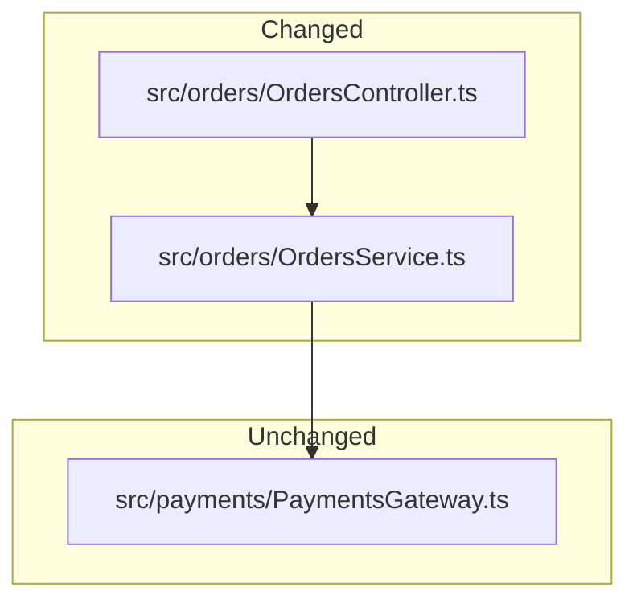

# Architecture Diagram

Show the system layering and the boundary between changed and unchanged parts.

## Good For

- the change crosses multiple modules, services, pages, or layers
- deployment topology or service boundaries shift

## Avoid When

- one file or one local module changes without boundary movement
- a short bullet list already makes the boundary obvious

## Alternative Representations

- layered module list
- changed/unchanged responsibility table

## Template

Replace the example paths with the real changed and unchanged boundaries from the current codebase. Keep the graph focused on the modules that matter for this change.
