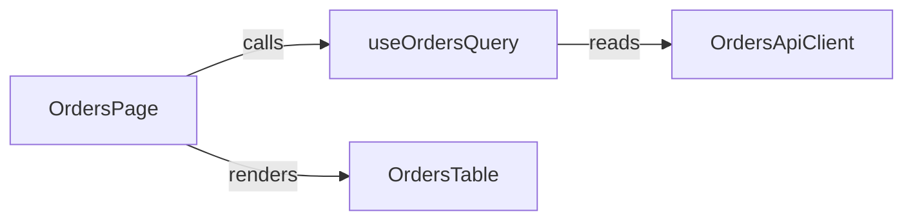

# Component / Module Diagram

Show responsibilities and dependency direction between components involved in this change.

## Good For

- new modules or components are introduced
- module boundaries or ownership are restructured

## Avoid When

- a simple responsibility list is enough
- the change is only about visual layout, not dependency direction

## Alternative Representations

- responsibility list grouped by module
- ownership table

## Template

Replace the example symbols with actual components, hooks, services, modules, or classes from the codebase. Label edges with the real interaction type such as `calls`, `renders`, `reads`, `writes`, or `publishes`.
