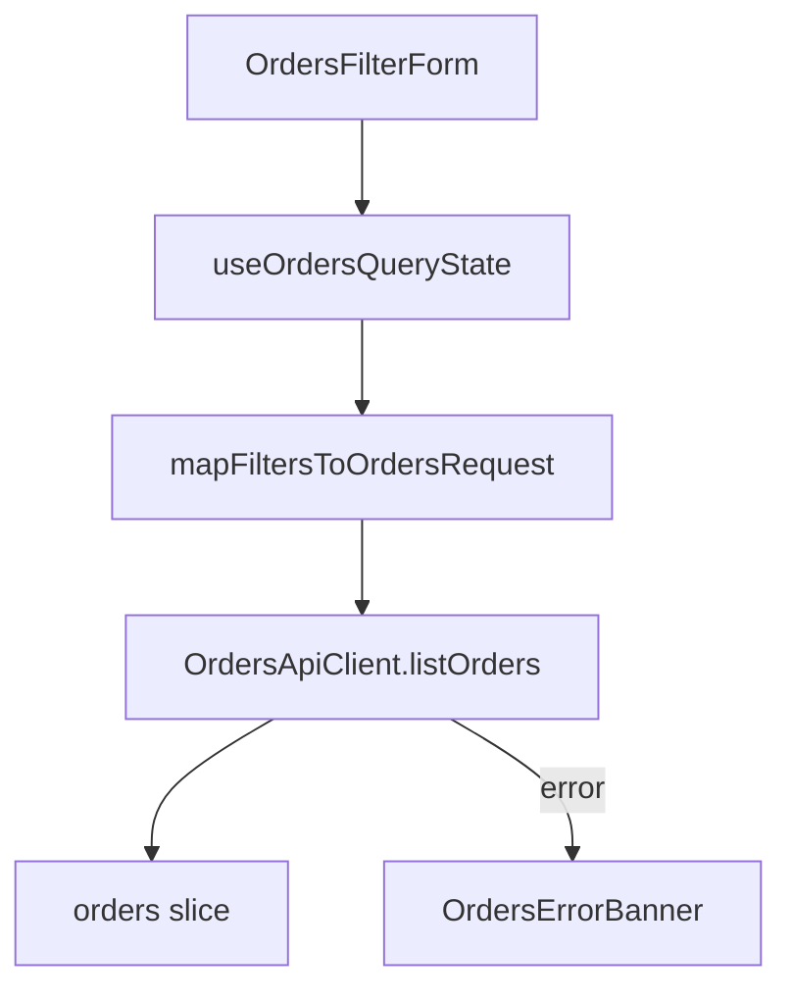

# Data Flow Diagram

Trace data from input source through every transformation step to final persistence or output.

## Good For

- data is created, transformed, or persisted
- data crosses module or service boundaries

## Avoid When

- the path is a single obvious read or write
- ordered interaction matters more than transformation, in which case use sequence

## Alternative Representations

- numbered transformation steps
- source-to-sink table

## Template

Replace the example nodes with the real source, transformation, validation, persistence, cache, and error-handling points from the current codebase. Add or remove nodes so the path matches the actual flow.
