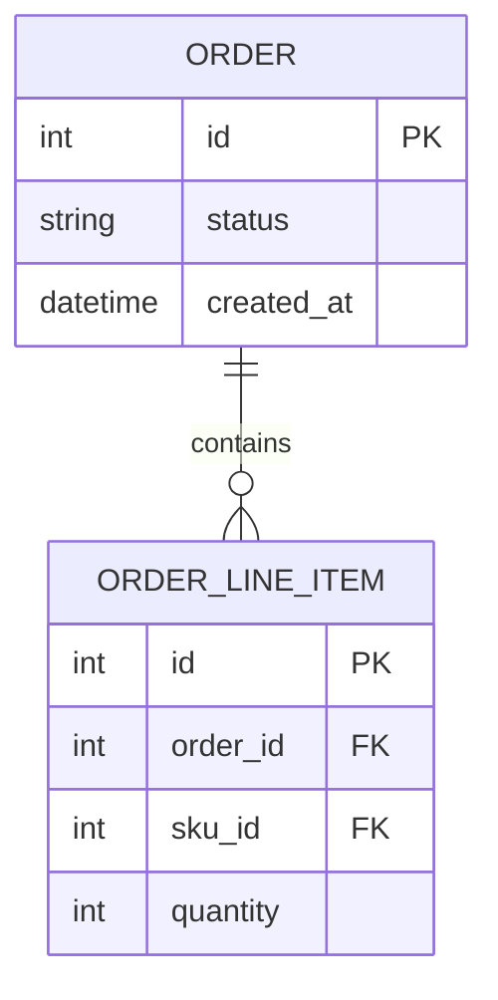

# ER Diagram

Show entities, relationships, and key fields affected by this change.

## Good For

- database schema is added or modified
- core domain model relationships change

## Avoid When

- only a few isolated fields change and a small table is clearer
- the change is behavioral without structural model impact

## Alternative Representations

- field and relationship table
- before/after schema notes

## Template

Replace the example entities and fields with the actual domain names from the current codebase. Include only relationships and fields that matter for this change, and keep PK, FK, and unique constraints explicit.
