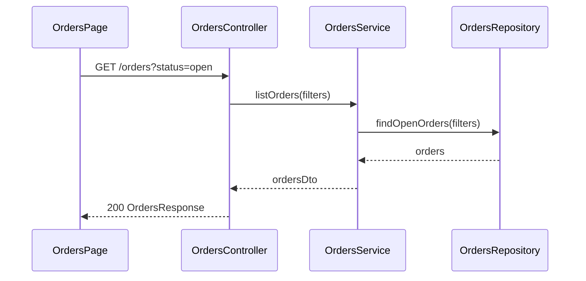

# Sequence / Flow Diagram

Show the ordered interaction between participants for the core business process.

## Good For

- multi-step interaction between components or services
- async coordination, retries, or external system calls
- branching or error handling paths matter

## Avoid When

- only structure or ownership matters, not ordering
- a simple linear bullet list is enough

## Alternative Representations

- numbered request/response steps
- arrow-based text flow

## Template

Replace the example participants and messages with actual runtime participants from the current codebase. Add `alt` or `else` blocks when retries, branching, or error paths matter.
