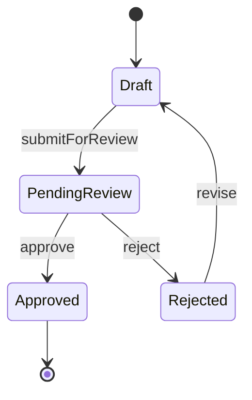

# State Machine Diagram

Define states, transitions, and guard conditions for entities with lifecycle.

## Good For

- an entity or process has discrete states
- transition conditions or terminal states need explicit definition

## Avoid When

- the behavior is mostly linear and a sequence is clearer
- states are implied and do not affect implementation decisions

## Alternative Representations

- state transition table
- status rules list

## Template

Replace the example states and transitions with the actual lifecycle in the current codebase. Keep trigger names, guards, and terminal states explicit when they influence execution logic.
