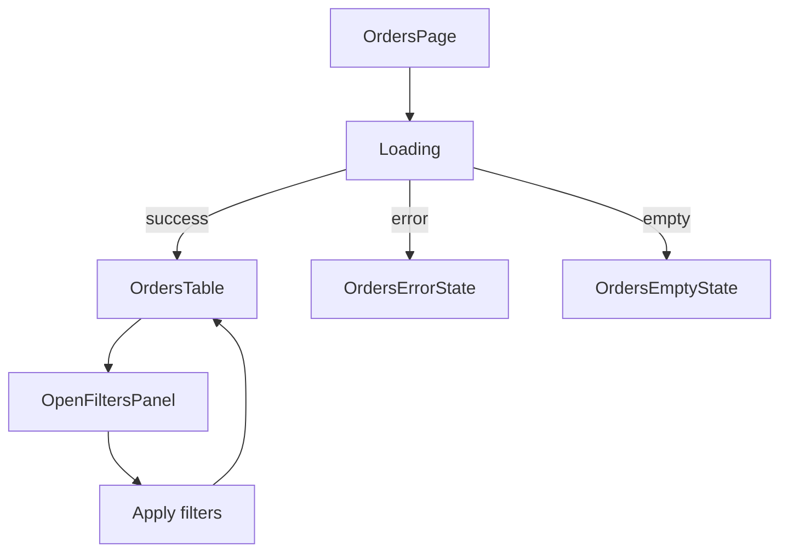

# UI Interaction Flow

Show the user-visible flow between screens, actions, and runtime states. Use this for interaction flow, not static layout.

## Good For

- user-facing workflows are added or modified
- loading, error, empty, or confirmation states affect interaction design

## Avoid When

- the main question is page or component layout, in which case use `ui-layout.md`
- there is no meaningful state or interaction flow to describe

## Alternative Representations

- arrow-based text flow
- numbered interaction steps

## Template

Replace the example pages, components, and states with the actual interaction flow from the current codebase. Keep the flow focused on user-visible transitions rather than visual containment.
